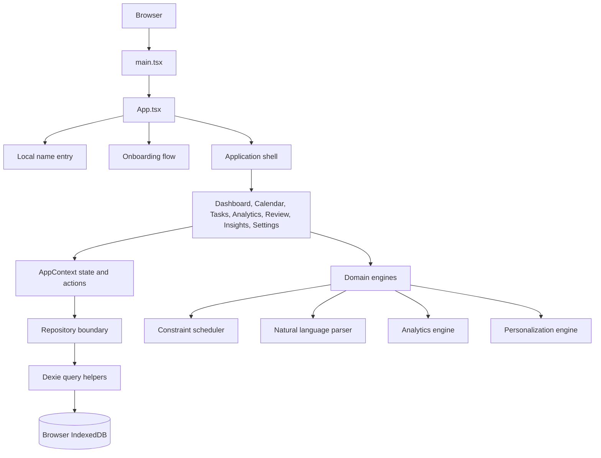
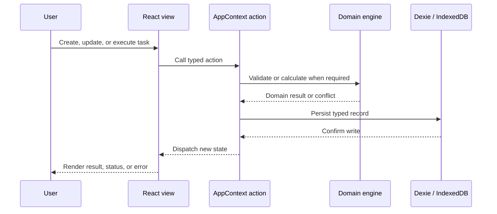
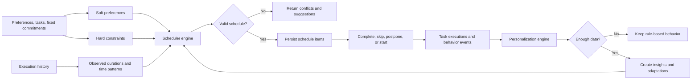
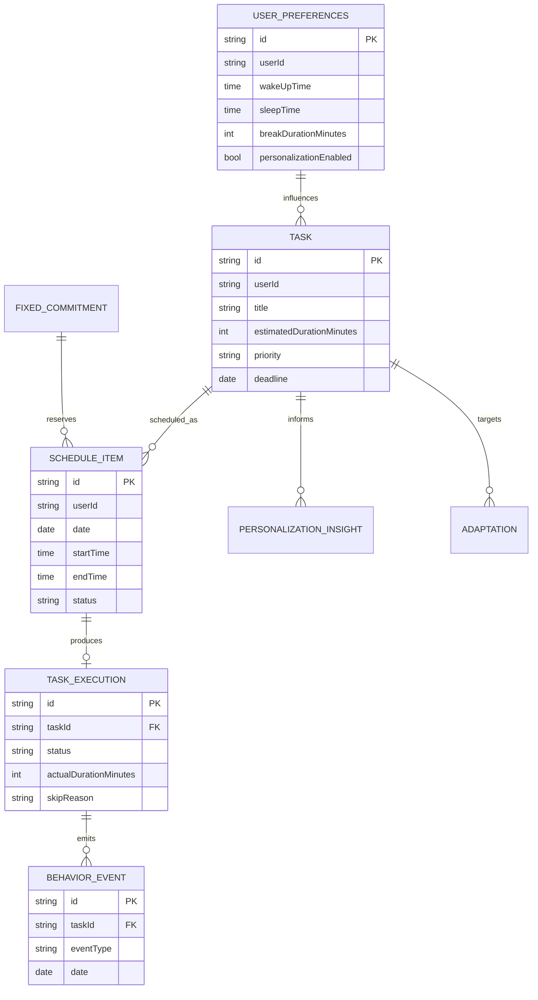
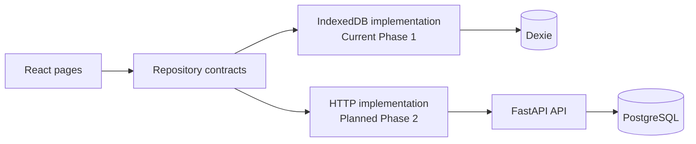
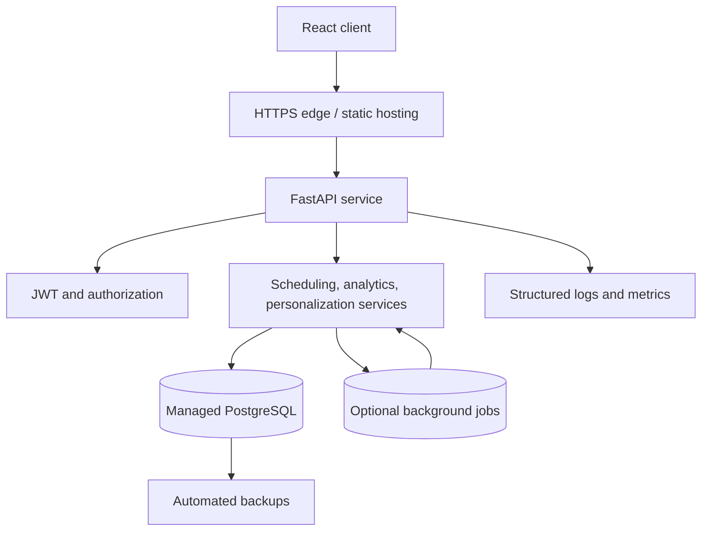

# Amigo

Amigo is an offline-first adaptive scheduler for people whose plans need to reflect reality. It combines constraint-aware planning, execution tracking, and behavioral analysis to improve future schedules without pretending to know more than the available data supports.

<!-- Task snapshot 78965a73-805d-4a3b-aee6-8d70aff73547: the credential gate was replaced with local name-only onboarding so the Phase 1 product can start without account friction or a backend dependency. -->

## Project Status

| Area | Status | Implementation |
| --- | --- | --- |
| Web application | Complete | React 18, TypeScript, Vite, Tailwind CSS |
| Scheduling | Complete | Constraint-aware TypeScript engine |
| Personalization | Complete | Statistical pattern detection with cold-start thresholds |
| Analytics | Complete | Completion, delay, duration, time-window, and category metrics |
| Persistence | Complete | Dexie over browser IndexedDB |
| Authentication | Phase 1 local mode | Name-only local identity; no credentials required |
| Server API | Planned | FastAPI, PostgreSQL, JWT, and multi-user support |

## Engineering Goals

- Produce schedules that respect hard constraints and make soft preferences explicit.
- Record execution outcomes so future schedules can adapt to observed behavior.
- Surface conflicts, empty states, loading states, and errors instead of hiding them.
- Keep user data local in Phase 1 and preserve a repository boundary for the future API.
- Keep personalization honest: no recommendations are shown as learned until enough data exists.

## Quick Start

### Requirements

- Node.js 18 or newer
- npm 9 or newer
- A modern browser with IndexedDB support

### Install and run

```bash
npm install
npm run dev
```

The Vite server prints the local URL, normally `http://localhost:5173` or the next available port.

### Verification commands

```bash
npm run typecheck   # TypeScript validation
npm run build       # Production bundle
```

## Development Structure

```text
Amigo/
├── src/
│   ├── api/                    # Repository interfaces and future HTTP boundary
│   ├── auth/                   # Phase 1 local identity adapter
│   ├── components/             # Feature pages and reusable UI primitives
│   │   ├── analytics/           # Analytics and weekly review
│   │   ├── auth/                # Name-only entry screen
│   │   ├── calendar/            # Day/week schedule views
│   │   ├── dashboard/           # Current day execution view
│   │   ├── insights/            # Learned patterns and adaptations
│   │   ├── layout/              # Navigation and application shell
│   │   ├── onboarding/          # Seven-step setup flow
│   │   ├── settings/            # Preferences and data management
│   │   ├── tasks/               # Task CRUD and natural input
│   │   └── ui/                  # Buttons, cards, fields, modals, tabs, toasts
│   ├── db/                     # Dexie database and query helpers
│   ├── engine/                 # Scheduling, parsing, analytics, personalization
│   ├── hooks/                  # Cross-cutting React hooks
│   ├── store/                  # AppContext state and mutation actions
│   ├── types/                  # Shared domain contracts
│   ├── App.tsx                 # Authentication, onboarding, and page routing
│   ├── index.css               # Design tokens and global styles
│   └── main.tsx                # Browser entry point
├── backend/                   # Phase 2 FastAPI scaffold and deployment files
├── docs/
│   ├── ARCHITECTURE.md         # Extended architecture and security model
│   ├── DATABASE_SCHEMA.sql     # Planned PostgreSQL schema
│   └── ...                     # Delivery, security, and deployment notes
├── index.html
├── package.json
├── tsconfig.json
└── vite.config.js
```

## Runtime Architecture



### Request and state boundary

The UI reads state from `AppContext`. Mutations are exposed as actions rather than direct database calls. Actions construct typed domain records, persist them through Dexie, and dispatch the updated state. This keeps view components focused on interaction and rendering.



## Scheduling and Adaptation Flow



### Cold-start policy

| Execution records | Level | Behavior |
| ---: | --- | --- |
| 0-4 | Cold start | Rules only; no learned recommendations |
| 5-14 | Early | Per-task duration statistics and simple heuristics |
| 15-39 | Developing | Time-of-day and day-of-week patterns |
| 40+ | Mature | Category-specific and broader personalization |

The current level is visible in the UI. This is a product contract, not only an implementation detail.

## Domain Model



## Repository Strategy

The frontend is deliberately written against a repository boundary so persistence can move from local storage to an authenticated service without changing page components.



The current `AppContext` still uses the local database helpers directly in some actions. The repository interfaces in `src/api` define the migration boundary and should become the single application data access surface as Phase 2 is implemented.

## Feature Responsibilities

| Feature | Primary code | Responsibility |
| --- | --- | --- |
| Scheduling | `src/engine/scheduler.ts` | Find valid slots using hard and soft constraints |
| Natural input | `src/engine/nlParser.ts` | Parse plain-language schedule descriptions into typed values |
| Personalization | `src/engine/personalization.ts` | Detect reliable patterns and propose adaptations |
| Analytics | `src/engine/analytics.ts` | Aggregate execution history into explainable metrics |
| Persistence | `src/db/index.ts` | Store and query local domain records |
| State | `src/store/AppContext.tsx` | Coordinate loading, mutation, and UI state |
| UI system | `src/components/ui` | Consistent accessible controls and feedback states |

## Planned Production Architecture



Phase 2 will add server-side validation, user ownership checks, JWT access and refresh tokens, Argon2id password hashing, migrations, rate limiting, security headers, audit logs, and the HTTP repository implementation. The current local mode must remain functional while that work is developed.

## Security and Data Ownership

### Phase 1

- Data is stored in the browser's IndexedDB database named `amigo_db`.
- No credentials or remote account are required.
- The user can export or delete local data from Settings.
- Natural-language input is parsed and validated before records are persisted.

### Phase 2 requirements

- Validate every request with typed Pydantic schemas.
- Authorize every resource against the authenticated user.
- Use parameterized queries through SQLAlchemy.
- Protect sessions with short-lived access tokens and secure refresh cookies.
- Add CSP, CORS, CSRF, rate limiting, audit logging, and operational monitoring.

## Engineering Workflow

1. Make the smallest change inside the owning feature or engine.
2. Run `npm run typecheck` after TypeScript changes.
3. Run `npm run build` before merging or deploying.
4. Test the affected user flow in the browser, including loading, empty, error, and mobile states where relevant.
5. Keep domain logic independent from React and browser APIs where practical.
6. Document new contracts, schema changes, and architecture decisions in `docs/`.

## Design System

The interface uses a compact operational language: pale sage workspace surfaces, charcoal information panels, coral action emphasis, butter-yellow supporting accents, Space Grotesk headings, and DM Sans body copy. Color and motion are used to clarify state and action; decoration does not replace product information.

Accessibility requirements include semantic controls, visible keyboard focus, labelled inputs and icon buttons, readable contrast, reduced-motion support, and responsive layouts from mobile through desktop.

## Browser Support

Modern Chrome, Edge, Firefox, and Safari releases with IndexedDB support. The application is client-side and does not require a backend for Phase 1.

## License

MIT

## Technology

React 18 · TypeScript · Vite · Tailwind CSS · Dexie · IndexedDB · Recharts · date-fns · dnd-kit · Framer Motion